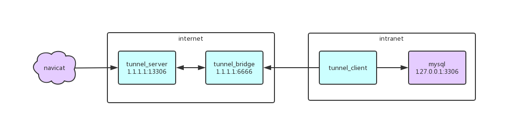

# 项目介绍

有时候，我们在外想要访问家里或公司主机的资料，要么由于主机处于内网下，要么就是是运营商随机分配的一个公网IP，都很难直接连上主机获取资料。

那么，有什么办法可以解决这一难题？答案就是**内网穿透**。当内网中的主机没有静态IP地址要被外网稳定访问时可以使用内网穿透。

**go-netbus**【网络直通车】是为解决内网穿透问题开发的工具。

## 功能列表

- 基于 TCP 协议
- 支持多端口穿透
- 支持断线重连
- 支持指定访问端口
- 支持身份认证，引入基于有效期的身份失效机制
- 单服务支持多个连接

## 工作原理



通常我们需要访问一个服务，只需要直接通过地址连接就可以了，但是如果服务处在一个与访问者隔离的内网环境里，我们就不能访问了。
不过也不是没有办法，如果内网服务可以访问外网的话，我们就可以找到突破点。

### 实现步骤

**服务端部分**
1. 启动`tunnel_bridge`， 监听`tunnel_client`的连接。
2. 启动`tunnel_server`， 监听`用户`的访问请求。

**客户端部分**
1. 启动`tunnel_client`， 向`tunnel_bridge`拨号，建立连接。
2. 如果`用户`发起请求，则向`内网服务`拨号，建立连接。
3. 处理连接双方的通讯，实现穿透。

## 如何部署实现内网穿透

**服务端** 需要一台具有公网 IP 的服务器（比如阿里云），配置不限，将服务端部署上去。  
**客户端** 部署在内网服务器，与需要穿透的服务（比如 mysql）在同一个局域网。

> 需要注意的是，实现穿透后，就相当于将服务暴露在互联网，会面临被攻击的风险。

## 基于原 key 生成带失效时间的 key

> 注意：此 key 仅用于客户端，服务端用的还是原 key

```bash
# 假如希望生成到期日期为 2019-12-31 的 key，使用命令：

$ netbus -generate <key> [expired-time]

# key                原 key ， 必填参数
# expired-time       到期日期，如：2019-12-31，未输入此参数的话，生成有效期为一个月的 key

```

## 启动方式

支持两种方式启动:

- 纯命令行启动（不需要配置文件）
- 配置文件启动（需要配置文件）**【推荐】**

### 命令行启动

```bash
# 启动服务端

$ netbus -server <key> <port>

# 注释
# key                 建议长度 6-16 个字符，用于身份校验
# port                服务端端口，不要使用保留端口，必填

```

```bash
# 启动客户端

$ netbus -client <key> <server:port> <local:port> [access-port] [max-redial-times]

# 注释
# key                与服务端保持一致
# server:port        服务端地址，格式如：45.32.78.129:6666
# local:port         被代理服务地址，多个以逗号隔开，比如：127.0.0.1:8080,127.0.0.1:9200
# access-port        访问端口，与 local:port 一一对应，多个以逗号隔开，比如：9090,10200， 可选，若未填访问端口保持与 local:port 一致
# max-redial-times   最大重连次数，-1 表示无限重连，可选参数
```

### 配置文件启动

**服务端配置**
```ini
# 服务端配置
[server]
# 代理端口
port = 6666
# Key 建议长度 6-16 个字符，用于身份校验
key = winshu
```

**客户端配置**
```ini
# 客户端配置
[client]
# 与服务端保持一致
key = winshu
# 服务端地址，格式 ip:port
server-host = 127.0.0.1:6666
# 内网被代理服务地址(多个用逗号隔开，端口不能相同)，格式 ip:port,ip:port
local-host = 127.0.0.1:3306
# 访问端口(可选，未设置时访问端口与代理端口相同)
access-port = 13306
# 最大重连次数，-1 表示一直重连
max-redial-times = 20
```

**启动命令**
```bash
# 启动服务端
$ netbus -server

# 启动客户端
$ netbus -client
```